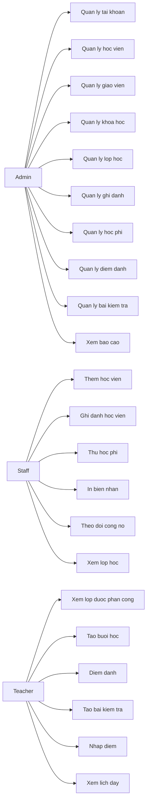
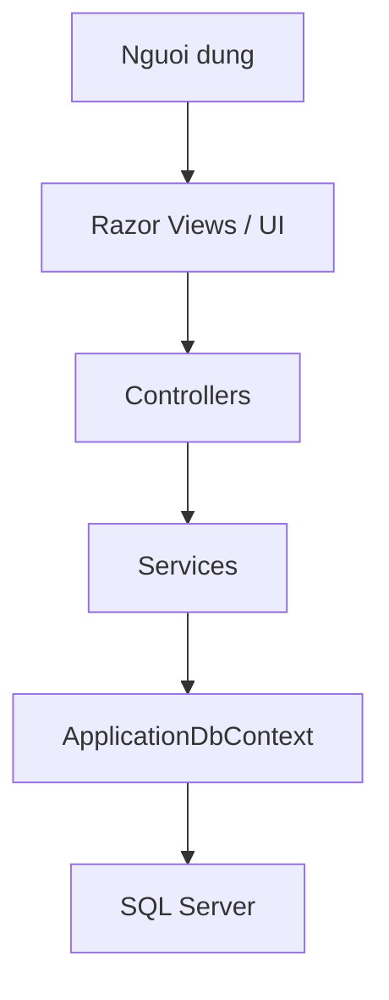
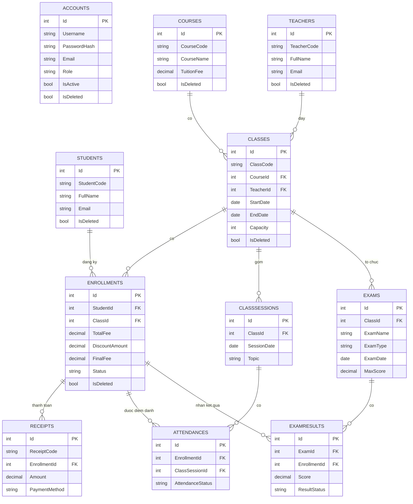

# WEBSITE QUAN LY TRUNG TAM NGOAI NGU

## 1. Muc dich cua file nay

File nay duoc viet theo huong:

- giup ban nam duoc toan bo du an nhanh de di thuyet trinh
- giai thich du an theo ngon ngu de noi truoc lop
- chi ro kien truc, database, backend, frontend, use case, luong nghiep vu
- chi ro file nao lam gi trong source code
- chi ra nhung diem can luu y de tra loi cau hoi cua giang vien

Neu ban chi con it thoi gian, hay doc theo thu tu sau:

1. Phan 2: Tong quan de tai
2. Phan 4: Bai toan nghiep vu
3. Phan 6: Kien truc tong the
4. Phan 8: Database va ERD
5. Phan 10: Luong hoat dong theo vai tro
6. Phan 13: Cac file quan trong
7. Phan 16: Goi y cach thuyet trinh
8. Phan 17: Cac cau hoi de bi hoi

---

## 2. Tong quan de tai

### Ten de tai

**Xay dung he thong website quan ly trung tam ngoai ngu**

### Muc tieu cua he thong

He thong duoc xay dung de quan ly cac nghiep vu cot loi cua mot trung tam ngoai ngu, gom:

- quan ly tai khoan va phan quyen
- quan ly hoc vien
- quan ly giao vien
- quan ly khoa hoc
- quan ly lop hoc
- quan ly ghi danh
- quan ly hoc phi va bien nhan
- quan ly buoi hoc
- quan ly diem danh
- quan ly bai kiem tra va ket qua hoc tap
- dashboard, thong ke, cong no

### Y tuong trinh bay ngan gon khi thuyet trinh

Ban co the noi:

> Day la he thong web quan ly trung tam ngoai ngu duoc xay dung bang ASP.NET Core MVC, EF Core va SQL Server. He thong ho tro 3 vai tro la Admin, Staff va Teacher. Moi vai tro co dashboard va chuc nang rieng, dong thoi du lieu duoc luu va xu ly tren co so du lieu that, khong con la mock data.

---

## 3. Cong nghe su dung

### Backend

- ASP.NET Core MVC (.NET 8)
- C#
- Entity Framework Core
- SQL Server
- Cookie Authentication

### Frontend

- Razor View
- Bootstrap 5
- JavaScript
- jQuery
- Chart.js
- Bootstrap Icons

### Ly do chon cong nghe

- ASP.NET Core MVC phu hop mon hoc Lap trinh web va ung dung
- EF Core giup thao tac co so du lieu theo huong ORM, de bao tri
- SQL Server phu hop voi de tai quan ly nghiep vu
- Razor View de xay dung giao dien nhanh, ro luong controller -> view
- Bootstrap giup giao dien responsive va de demo

---

## 4. Bai toan nghiep vu ma he thong giai quyet

### 4.1 Cac doi tuong nghiep vu chinh

He thong xoay quanh 11 bang nghiep vu chinh:

- `Accounts`
- `Students`
- `Teachers`
- `Courses`
- `Classes`
- `Enrollments`
- `Receipts`
- `ClassSessions`
- `Attendances`
- `Exams`
- `ExamResults`

### 4.2 Van de thuc te can giai quyet

Neu khong co he thong, trung tam se gap cac van de:

- kho quan ly hoc vien va giao vien theo ma
- kho biet hoc vien da ghi danh lop nao
- kho theo doi hoc phi da thu va cong no con lai
- kho quan ly lich hoc, buoi hoc, diem danh
- kho quan ly bai kiem tra va diem cua hoc vien
- kho thong ke tong quan de ra quyet dinh

### 4.3 Cach he thong giai quyet

He thong chia theo vai tro:

- `Admin`: quan ly tong the du lieu, tai khoan, khoa hoc, lop hoc, giao vien, hoc vien, hoc phi, bao cao
- `Staff`: xu ly van hanh hinh chinh va giao vu, them hoc vien, ghi danh, thu hoc phi, theo doi cong no
- `Teacher`: quan ly lop duoc phan cong, tao buoi hoc, diem danh, tao bai kiem tra, nhap diem

---

## 5. Vai tro nguoi dung va use case

## 5.1 Vai tro Admin

Admin co cac use case chinh:

- dang nhap vao he thong
- quan ly tai khoan
- quan ly hoc vien
- quan ly giao vien
- quan ly khoa hoc
- quan ly lop hoc
- quan ly ghi danh
- quan ly hoc phi
- quan ly buoi hoc
- quan ly diem danh
- quan ly bai kiem tra
- quan ly ket qua kiem tra
- xem bao cao va dashboard
- quan ly noi dung public nhu tin tuc va homepage

## 5.2 Vai tro Staff

Staff co cac use case chinh:

- dang nhap vao dashboard giao vu
- them hoc vien moi
- sua ho so hoc vien
- ghi danh hoc vien vao lop
- thu hoc phi
- in bien nhan
- theo doi cong no
- xem thong tin lop va xep lop

## 5.3 Vai tro Teacher

Teacher co cac use case chinh:

- dang nhap vao dashboard giao vien
- xem lop duoc phan cong
- tao buoi hoc
- xem lich day
- diem danh theo buoi
- tao bai kiem tra
- nhap diem cho hoc vien
- xem lai ket qua da nhap

## 5.4 Use case diagram tong quat



---

## 6. Kien truc tong the cua he thong

Du an duoc to chuc theo mo hinh MVC ket hop service layer.



### 6.1 Y nghia tung tang

### Views

- hien thi giao dien
- nhan du lieu tu controller
- khong query database truc tiep

### Controllers

- nhan request tu nguoi dung
- goi service de xu ly nghiep vu
- tra ve view hoac redirect
- controller duoc giu mong

### Services

- chua logic nghiep vu
- doc/ghi du lieu
- validation
- xu ly duplicate, sai role, sai state

### DbContext

- la cau noi giua app va SQL Server qua EF Core
- map entity sang bang du lieu
- khai bao relationship, unique index, computed column

### SQL Server

- luu du lieu that cua he thong
- la nguon su that cua cac nghiep vu trung tam

---

## 7. Kien truc source code trong project

Thu muc chinh cua project nam trong:

`D:\ASP-24CNTT\Quan-ly-trung-tam-ngoai-ngu\Quan-ly-trung-tam-ngoai-ngu`

### Cau truc lon

```text
Quan-ly-trung-tam-ngoai-ngu
├─ Areas
│  ├─ Admin
│  ├─ Staff
│  └─ Teacher
├─ Controllers
├─ Data
├─ Infrastructure
├─ Models
├─ Services
├─ ViewModels
├─ Views
├─ wwwroot
└─ App_Data
```

### 7.1 `Areas`

Dung de tach module theo vai tro:

- `Areas/Admin`: khu vuc quan tri
- `Areas/Staff`: khu vuc giao vu
- `Areas/Teacher`: khu vuc giao vien

Day la cach tach rat de thuyet trinh vi moi vai tro co controller rieng, route rieng, dashboard rieng.

### 7.2 `Controllers`

Chua cac controller public nhu:

- `HomeController`
- `AccountController`
- `CoursesController`
- `NewsController`
- `ContactController`

### 7.3 `Data`

Chua `ApplicationDbContext` va cac entity map voi database.

### 7.4 `Infrastructure`

Chua cac thanh phan dung chung:

- constants
- authorize attribute
- startup tasks
- helper UI

### 7.5 `Models`

Chua domain model va input model cho form.

### 7.6 `Services`

Chua business logic:

- auth service
- read service
- management service
- public site content service
- security service

### 7.7 `ViewModels`

Chua model de render UI:

- list page
- form page
- details page
- dashboard
- public pages

### 7.8 `Views`

Chua Razor View:

- public views
- shared layouts
- shared modules

### 7.9 `wwwroot`

Chua:

- css
- js
- lib
- asset frontend

### 7.10 `App_Data`

Chua du lieu noi dung public dang luu theo file JSON:

- `public-news.json`
- `public-site-settings.json`

Luu y:

- Day khong phai 11 bang nghiep vu chinh cua trung tam
- Day la noi dung public de admin quan ly trang chu va tin tuc

---

## 8. Database, bang du lieu va ERD

## 8.1 Tong quan database

Database chinh cua de tai la:

- `LanguageCenterDB`

Connection string duoc doc tu:

- [appsettings.json](D:/ASP-24CNTT/Quan-ly-trung-tam-ngoai-ngu/Quan-ly-trung-tam-ngoai-ngu/appsettings.json)
- [appsettings.Development.json](D:/ASP-24CNTT/Quan-ly-trung-tam-ngoai-ngu/Quan-ly-trung-tam-ngoai-ngu/appsettings.Development.json)

Trong source, `Program.cs` dang dang ky:

- `ApplicationDbContext`
- SQL Server provider
- retry on failure
- command timeout

## 8.2 Cac bang va y nghia

### `Accounts`

Luu tai khoan dang nhap he thong.

Thuoc tinh quan trong:

- `Username`
- `PasswordHash`
- `FullName`
- `Email`
- `Role`
- `IsActive`
- `IsDeleted`

### `Students`

Luu ho so hoc vien.

Thuoc tinh quan trong:

- `StudentCode`
- `FullName`
- `DateOfBirth`
- `Gender`
- `Phone`
- `Email`
- `Address`
- `Status`
- `IsDeleted`

### `Teachers`

Luu ho so giao vien.

Thuoc tinh quan trong:

- `TeacherCode`
- `FullName`
- `Phone`
- `Email`
- `Specialization`
- `Status`
- `IsDeleted`

### `Courses`

Luu thong tin khoa hoc.

Thuoc tinh quan trong:

- `CourseCode`
- `CourseName`
- `Description`
- `DurationHours`
- `TuitionFee`
- `Status`
- `IsDeleted`

### `Classes`

Luu cac lop hoc mo theo tung khoa hoc.

Thuoc tinh quan trong:

- `ClassCode`
- `ClassName`
- `CourseId`
- `TeacherId`
- `StartDate`
- `EndDate`
- `ScheduleText`
- `Capacity`
- `Status`
- `IsDeleted`

### `Enrollments`

Luu viec hoc vien dang ky vao lop.

Thuoc tinh quan trong:

- `StudentId`
- `ClassId`
- `EnrollDate`
- `Status`
- `TotalFee`
- `DiscountAmount`
- `FinalFee`
- `IsDeleted`

Luu y quan trong:

- `FinalFee` la computed column
- duoc tinh tu `TotalFee - DiscountAmount`

### `Receipts`

Luu bien nhan thu hoc phi.

Thuoc tinh quan trong:

- `ReceiptCode`
- `EnrollmentId`
- `PaymentDate`
- `Amount`
- `PaymentMethod`
- `Note`

### `ClassSessions`

Luu tung buoi hoc cua mot lop.

Thuoc tinh quan trong:

- `ClassId`
- `SessionDate`
- `Topic`
- `Note`

### `Attendances`

Luu diem danh theo hoc vien va buoi hoc.

Thuoc tinh quan trong:

- `EnrollmentId`
- `ClassSessionId`
- `AttendanceStatus`
- `Note`

### `Exams`

Luu bai kiem tra.

Thuoc tinh quan trong:

- `ClassId`
- `ExamName`
- `ExamType`
- `ExamDate`
- `MaxScore`

### `ExamResults`

Luu diem cua hoc vien theo bai kiem tra.

Thuoc tinh quan trong:

- `ExamId`
- `EnrollmentId`
- `Score`
- `ResultStatus`
- `Note`

## 8.3 Cac rang buoc quan trong trong DB

### Unique

- `Accounts.Username`
- `Accounts.Email`
- `Students.StudentCode`
- `Students.Email`
- `Teachers.TeacherCode`
- `Teachers.Email`
- `Courses.CourseCode`
- `Classes.ClassCode`
- `(Enrollments.StudentId, Enrollments.ClassId)`
- `Receipts.ReceiptCode`
- `(Attendances.EnrollmentId, Attendances.ClassSessionId)`
- `(ExamResults.ExamId, ExamResults.EnrollmentId)`

### Soft delete

Nhieu bang co cot `IsDeleted`:

- `Accounts`
- `Students`
- `Teachers`
- `Courses`
- `Classes`
- `Enrollments`

### Enum / gia tri nghiep vu

- Role: `Admin`, `Staff`, `Teacher`
- Enrollment Status: `DangHoc`, `BaoLuu`, `HoanThanh`, `Huy`
- PaymentMethod: `Cash`, `Transfer`, `Card`
- AttendanceStatus: `Present`, `Absent`, `Late`
- ExamType: `Midterm`, `Final`, `Speaking`, `Test`
- ResultStatus: `Pass`, `Fail`

## 8.4 ERD tong quat



### Cach giai thich ERD khi thuyet trinh

Ban co the noi:

> Trong he thong, hoc vien khong dang ky truc tiep vao khoa hoc ma dang ky vao lop hoc qua bang Enrollments. Lop hoc thuoc mot khoa hoc va co the duoc phan cong cho mot giao vien. Tu ghi danh, he thong sinh ra cac nghiep vu phat sinh nhu hoc phi qua Receipts, diem danh qua Attendances, va ket qua hoc tap qua ExamResults.

---

## 9. Backend: cach he thong hoat dong

## 9.1 Diem vao cua ung dung

File quan trong:

- [Program.cs](D:/ASP-24CNTT/Quan-ly-trung-tam-ngoai-ngu/Quan-ly-trung-tam-ngoai-ngu/Program.cs)

Day la noi:

- dang ky MVC
- dang ky `ApplicationDbContext`
- cau hinh cookie authentication
- cau hinh session
- dang ky cac service qua DI
- map route cho `Areas`

### Cac service duoc DI

- `IAccountPasswordService -> AccountPasswordService`
- `ILanguageCenterReadService -> EfLanguageCenterReadService`
- `IAccountAuthService -> EfAuthService`
- `ILanguageCenterManagementService -> EfLanguageCenterManagementService`
- `IPublicSiteContentService -> PublicSiteContentService`

## 9.2 Authentication va authorization

### Login

File chinh:

- [AccountController.cs](D:/ASP-24CNTT/Quan-ly-trung-tam-ngoai-ngu/Quan-ly-trung-tam-ngoai-ngu/Controllers/AccountController.cs)
- [EfAuthService.cs](D:/ASP-24CNTT/Quan-ly-trung-tam-ngoai-ngu/Quan-ly-trung-tam-ngoai-ngu/Services/Ef/EfAuthService.cs)

Luong login:

1. Nguoi dung nhap username hoac email va password
2. `AccountController` goi `IAccountAuthService.ValidateLoginAsync`
3. `EfAuthService` query bang `Accounts`
4. Kiem tra:
   - co ton tai tai khoan khong
   - co bi khoa khong
   - password co dung khong
5. Neu hop le, he thong tao cookie auth va gan claims:
   - `NameIdentifier`
   - `Name`
   - `Email`
   - `Role`
6. Redirect theo role:
   - Admin -> `/Admin`
   - Staff -> `/Staff`
   - Teacher -> `/Teacher`

### Password hashing

File chinh:

- [AccountPasswordService.cs](D:/ASP-24CNTT/Quan-ly-trung-tam-ngoai-ngu/Quan-ly-trung-tam-ngoai-ngu/Services/Security/AccountPasswordService.cs)
- [Stage3StartupTasks.cs](D:/ASP-24CNTT/Quan-ly-trung-tam-ngoai-ngu/Quan-ly-trung-tam-ngoai-ngu/Infrastructure/Stage3StartupTasks.cs)

Diem hay de noi:

- Stage 2 da co auth that, nhung password con theo kieu legacy
- Stage 3 da nang cap sang hash password dung chuan
- Khi app khoi dong, `Stage3StartupTasks` se quet cac tai khoan cu va backfill sang hash moi

Ban co the noi:

> O giai doan final, nhom da nang cap luong bao mat mat khau. He thong khong tiep tuc dua vao plain text nhu giai doan dau ma su dung password hashing, dong thoi co co che backfill cho du lieu cu de khong lam vo seed data hien co.

### Phan quyen

File chinh:

- [DemoAuthorizeAttribute.cs](D:/ASP-24CNTT/Quan-ly-trung-tam-ngoai-ngu/Quan-ly-trung-tam-ngoai-ngu/Infrastructure/DemoAuthorizeAttribute.cs)
- [AppConstants.cs](D:/ASP-24CNTT/Quan-ly-trung-tam-ngoai-ngu/Quan-ly-trung-tam-ngoai-ngu/Infrastructure/AppConstants.cs)

Role duoc bao ve theo `Claims.Role`.

Neu vao sai khu vuc:

- Teacher vao Admin -> bi day ve `/Teacher`
- Staff vao Teacher -> bi day ve `/Staff`

## 9.3 Read service va management service

### Read service

File:

- [ILanguageCenterReadService.cs](D:/ASP-24CNTT/Quan-ly-trung-tam-ngoai-ngu/Quan-ly-trung-tam-ngoai-ngu/Services/Interfaces/ILanguageCenterReadService.cs)
- [EfLanguageCenterReadService.cs](D:/ASP-24CNTT/Quan-ly-trung-tam-ngoai-ngu/Quan-ly-trung-tam-ngoai-ngu/Services/Ef/EfLanguageCenterReadService.cs)

Nhiem vu:

- lay danh sach de do vao dashboard
- lay danh sach hoc vien, giao vien, khoa hoc, lop hoc
- lay hoc phi, cong no, diem danh, bai kiem tra, ket qua

### Management service

File:

- [ILanguageCenterManagementService.cs](D:/ASP-24CNTT/Quan-ly-trung-tam-ngoai-ngu/Quan-ly-trung-tam-ngoai-ngu/Services/Interfaces/ILanguageCenterManagementService.cs)
- [EfLanguageCenterManagementService.cs](D:/ASP-24CNTT/Quan-ly-trung-tam-ngoai-ngu/Quan-ly-trung-tam-ngoai-ngu/Services/Ef/EfLanguageCenterManagementService.cs)

Nhiem vu:

- CRUD tai khoan
- CRUD hoc vien
- CRUD giao vien
- CRUD khoa hoc
- CRUD lop hoc
- CRUD ghi danh
- CRUD bien nhan
- CRUD buoi hoc
- CRUD diem danh
- CRUD bai kiem tra
- CRUD ket qua kiem tra

### Vi sao tach service la tot

Vi:

- controller gon hon
- de test va de giai thich
- logic nghiep vu nam mot noi
- de nang cap sau nay

---

## 10. Frontend: giao dien va luong nguoi dung

## 10.1 Public site

He thong khong chi co dashboard ma con co giao dien public:

- trang chu
- gioi thieu
- khoa hoc
- lop hoc
- tin tuc
- lien he
- dang nhap
- dang ky
- quen mat khau

Noi dung public duoc quan ly boi:

- `PublicSiteContentService`
- du lieu luu trong `App_Data`

Luu y:

- module nay de phuc vu demo giao dien website hoan chinh
- nhung khong phai nghiep vu cot loi nam trong 11 bang SQL chinh

## 10.2 Dashboard theo role

### Admin dashboard

Chuc nang noi bat:

- tong quan hoc vien, lop, doanh thu
- truy cap nhanh den khoa hoc, lop hoc, giao vien, bai kiem tra
- bao cao, thong ke
- quan ly noi dung public

### Staff dashboard

Chuc nang noi bat:

- them hoc vien
- ghi danh
- thu hoc phi
- xem cong no
- in bien nhan

### Teacher dashboard

Chuc nang noi bat:

- xem lop duoc phan cong
- tao buoi hoc
- diem danh
- tao bai kiem tra
- nhap diem

## 10.3 Shared UI modules

Project dung cac module dung chung de tranh lap:

- `Dashboard.cshtml`
- `ManagementList.cshtml`
- `ManagementForm.cshtml`
- `ManagementDetails.cshtml`
- `ReceiptPrint.cshtml`

Y nghia:

- mot kieu giao dien chung cho list/form/details
- de dong bo UI
- de maintain de hon

---

## 11. Luong hoat dong chinh theo nghiep vu

## 11.1 Luong tao khoa hoc va mo lop

1. Admin dang nhap
2. Vao `Admin/Courses/Create`
3. Tao khoa hoc
4. Vao `Admin/Classes/Create`
5. Chon khoa hoc va giao vien
6. Tao lop hoc

## 11.2 Luong them hoc vien va ghi danh

1. Staff dang nhap
2. Vao `Staff/Students/Create`
3. Them hoc vien
4. Vao `Staff/Enrollments/Create`
5. Chon hoc vien va lop
6. Tao ghi danh

## 11.3 Luong thu hoc phi

1. Staff vao `Staff/Receipts/Create`
2. Chon ghi danh
3. Nhap so tien va phuong thuc thanh toan
4. Luu bien nhan
5. Xem `Staff/Receipts/Details/{id}`
6. In bien nhan qua `Staff/Receipts/Print/{id}`
7. Theo doi cong no tai `Staff/Debts`

## 11.4 Luong giao vien day hoc

1. Teacher dang nhap
2. Xem lop duoc phan cong
3. Tao buoi hoc tai `Teacher/Schedule/Create`
4. Diem danh tai `Teacher/Attendance/Create`
5. Tao bai kiem tra tai `Teacher/Exams/Create`
6. Nhap diem tai `Teacher/ExamResults/Create`

## 11.5 Luong admin xem bao cao

1. Admin dang nhap
2. Vao dashboard
3. Xem so lieu hoc vien, lop, doanh thu
4. Vao `Admin/Reports`
5. Xem cong no, doanh thu, top khoa hoc

---

## 12. Luong demo nen dung khi thuyet trinh

Ban nen demo theo thu tu sau:

1. Gioi thieu trang chu public
2. Dang nhap bang tai khoan Admin
3. Vao dashboard Admin
4. Tao 1 khoa hoc
5. Tao 1 lop hoc
6. Tao hoac xem giao vien
7. Dang xuat
8. Dang nhap bang Staff
9. Them 1 hoc vien
10. Ghi danh hoc vien vao lop
11. Thu hoc phi va in bien nhan
12. Xem cong no
13. Dang xuat
14. Dang nhap bang Teacher
15. Tao buoi hoc
16. Diem danh
17. Tao bai kiem tra
18. Nhap diem
19. Dang xuat
20. Dang nhap lai Admin de xem tong quan

### Tai khoan demo

- Admin: `admin / 123456`
- Staff: `staff01 / 123456`
- Teacher: `t001 / 123456`

---

## 13. Giai thich cac file code quan trong

Day la phan rat quan trong de ban nam source.

## 13.1 File cau hinh va khoi dong

### [Program.cs](D:/ASP-24CNTT/Quan-ly-trung-tam-ngoai-ngu/Quan-ly-trung-tam-ngoai-ngu/Program.cs)

Chuc nang:

- khoi tao app
- dang ky MVC
- dang ky DbContext
- cau hinh auth
- dang ky DI
- map route cho area va route mac dinh

### [appsettings.json](D:/ASP-24CNTT/Quan-ly-trung-tam-ngoai-ngu/Quan-ly-trung-tam-ngoai-ngu/appsettings.json)
### [appsettings.Development.json](D:/ASP-24CNTT/Quan-ly-trung-tam-ngoai-ngu/Quan-ly-trung-tam-ngoai-ngu/appsettings.Development.json)

Chuc nang:

- luu connection string
- luu SMTP config
- luu logging config

## 13.2 Tang du lieu

### [ApplicationDbContext.cs](D:/ASP-24CNTT/Quan-ly-trung-tam-ngoai-ngu/Quan-ly-trung-tam-ngoai-ngu/Data/ApplicationDbContext.cs)

Day la file quan trong nhat cua tang du lieu.

No lam cac viec:

- khai bao `DbSet`
- map bang
- map khoa chinh
- map foreign key
- map unique index
- map computed column `FinalFee`

Neu giang vien hoi "EF Core nam o dau", ban chi vao file nay.

## 13.3 Tang xac thuc va bao mat

### [AccountController.cs](D:/ASP-24CNTT/Quan-ly-trung-tam-ngoai-ngu/Quan-ly-trung-tam-ngoai-ngu/Controllers/AccountController.cs)

- login
- logout
- register
- forgot password

### [EfAuthService.cs](D:/ASP-24CNTT/Quan-ly-trung-tam-ngoai-ngu/Quan-ly-trung-tam-ngoai-ngu/Services/Ef/EfAuthService.cs)

- validate login tu bang `Accounts`
- register hoc vien
- query thong tin account

### [AccountPasswordService.cs](D:/ASP-24CNTT/Quan-ly-trung-tam-ngoai-ngu/Quan-ly-trung-tam-ngoai-ngu/Services/Security/AccountPasswordService.cs)

- hash password
- verify password
- nang cap du lieu cu

### [Stage3StartupTasks.cs](D:/ASP-24CNTT/Quan-ly-trung-tam-ngoai-ngu/Quan-ly-trung-tam-ngoai-ngu/Infrastructure/Stage3StartupTasks.cs)

- chay luc app khoi dong
- backfill password cu sang hash moi

### [DemoAuthorizeAttribute.cs](D:/ASP-24CNTT/Quan-ly-trung-tam-ngoai-ngu/Quan-ly-trung-tam-ngoai-ngu/Infrastructure/DemoAuthorizeAttribute.cs)

- bao ve route theo role

## 13.4 Tang service nghiep vu

### [ILanguageCenterReadService.cs](D:/ASP-24CNTT/Quan-ly-trung-tam-ngoai-ngu/Quan-ly-trung-tam-ngoai-ngu/Services/Interfaces/ILanguageCenterReadService.cs)

- interface doc du lieu

### [EfLanguageCenterReadService.cs](D:/ASP-24CNTT/Quan-ly-trung-tam-ngoai-ngu/Quan-ly-trung-tam-ngoai-ngu/Services/Ef/EfLanguageCenterReadService.cs)

- implementation doc du lieu that tu SQL Server

### [ILanguageCenterManagementService.cs](D:/ASP-24CNTT/Quan-ly-trung-tam-ngoai-ngu/Quan-ly-trung-tam-ngoai-ngu/Services/Interfaces/ILanguageCenterManagementService.cs)

- interface CRUD nghiep vu

### [EfLanguageCenterManagementService.cs](D:/ASP-24CNTT/Quan-ly-trung-tam-ngoai-ngu/Quan-ly-trung-tam-ngoai-ngu/Services/Ef/EfLanguageCenterManagementService.cs)

- xu ly CRUD that
- validation business rule
- duplicate check
- delete logic

## 13.5 Controller theo role

### Admin

Mot so file quan trong:

- [DashboardController.cs](D:/ASP-24CNTT/Quan-ly-trung-tam-ngoai-ngu/Quan-ly-trung-tam-ngoai-ngu/Areas/Admin/Controllers/DashboardController.cs)
- [AccountsController.cs](D:/ASP-24CNTT/Quan-ly-trung-tam-ngoai-ngu/Quan-ly-trung-tam-ngoai-ngu/Areas/Admin/Controllers/AccountsController.cs)
- [AcademicCatalogControllers.cs](D:/ASP-24CNTT/Quan-ly-trung-tam-ngoai-ngu/Quan-ly-trung-tam-ngoai-ngu/Areas/Admin/Controllers/AcademicCatalogControllers.cs)
- [AcademicPeopleControllers.cs](D:/ASP-24CNTT/Quan-ly-trung-tam-ngoai-ngu/Quan-ly-trung-tam-ngoai-ngu/Areas/Admin/Controllers/AcademicPeopleControllers.cs)
- [OperationsWorkflowControllers.cs](D:/ASP-24CNTT/Quan-ly-trung-tam-ngoai-ngu/Quan-ly-trung-tam-ngoai-ngu/Areas/Admin/Controllers/OperationsWorkflowControllers.cs)
- [OperationsAcademicControllers.cs](D:/ASP-24CNTT/Quan-ly-trung-tam-ngoai-ngu/Quan-ly-trung-tam-ngoai-ngu/Areas/Admin/Controllers/OperationsAcademicControllers.cs)
- [ExamsController.cs](D:/ASP-24CNTT/Quan-ly-trung-tam-ngoai-ngu/Quan-ly-trung-tam-ngoai-ngu/Areas/Admin/Controllers/ExamsController.cs)

### Staff

File quan trong:

- [StaffControllers.cs](D:/ASP-24CNTT/Quan-ly-trung-tam-ngoai-ngu/Quan-ly-trung-tam-ngoai-ngu/Areas/Staff/Controllers/StaffControllers.cs)
- [DebtsController.cs](D:/ASP-24CNTT/Quan-ly-trung-tam-ngoai-ngu/Quan-ly-trung-tam-ngoai-ngu/Areas/Staff/Controllers/DebtsController.cs)

### Teacher

File quan trong:

- [TeacherControllers.cs](D:/ASP-24CNTT/Quan-ly-trung-tam-ngoai-ngu/Quan-ly-trung-tam-ngoai-ngu/Areas/Teacher/Controllers/TeacherControllers.cs)
- [ExamsController.cs](D:/ASP-24CNTT/Quan-ly-trung-tam-ngoai-ngu/Quan-ly-trung-tam-ngoai-ngu/Areas/Teacher/Controllers/ExamsController.cs)

## 13.6 Frontend shared files

### Layout va partial

- [_Layout.cshtml](D:/ASP-24CNTT/Quan-ly-trung-tam-ngoai-ngu/Quan-ly-trung-tam-ngoai-ngu/Views/Shared/_Layout.cshtml)
- [_DashboardSidebar.cshtml](D:/ASP-24CNTT/Quan-ly-trung-tam-ngoai-ngu/Quan-ly-trung-tam-ngoai-ngu/Views/Shared/Partials/_DashboardSidebar.cshtml)

### Shared modules

- [Dashboard.cshtml](D:/ASP-24CNTT/Quan-ly-trung-tam-ngoai-ngu/Quan-ly-trung-tam-ngoai-ngu/Views/Shared/Modules/Dashboard.cshtml)
- [ManagementList.cshtml](D:/ASP-24CNTT/Quan-ly-trung-tam-ngoai-ngu/Quan-ly-trung-tam-ngoai-ngu/Views/Shared/Modules/ManagementList.cshtml)
- [ManagementForm.cshtml](D:/ASP-24CNTT/Quan-ly-trung-tam-ngoai-ngu/Quan-ly-trung-tam-ngoai-ngu/Views/Shared/Modules/ManagementForm.cshtml)
- [ManagementDetails.cshtml](D:/ASP-24CNTT/Quan-ly-trung-tam-ngoai-ngu/Quan-ly-trung-tam-ngoai-ngu/Views/Shared/Modules/ManagementDetails.cshtml)
- [ReceiptPrint.cshtml](D:/ASP-24CNTT/Quan-ly-trung-tam-ngoai-ngu/Quan-ly-trung-tam-ngoai-ngu/Views/Shared/Modules/ReceiptPrint.cshtml)

## 13.7 Public content

### [PublicSiteContentService.cs](D:/ASP-24CNTT/Quan-ly-trung-tam-ngoai-ngu/Quan-ly-trung-tam-ngoai-ngu/Services/PublicSiteContentService.cs)

Day la service quan ly:

- tin tuc
- noi dung trang chu
- noi dung gioi thieu
- noi dung lien he

No luu du lieu vao `App_Data/*.json`.

Hay noi ro khi thuyet trinh:

> Phan public content la de bo sung tinh hoan chinh cho website, con nghiep vu cot loi quan ly trung tam van nam tren SQL Server voi 11 bang chinh.

---

## 14. Frontend va backend ket noi voi nhau nhu the nao

Ban can nam mot luong mau:

### Vi du: Staff tao bien nhan hoc phi

1. User mo giao dien `Staff/Receipts/Create`
2. View render form Razor
3. Submit form len `ReceiptsController.Create`
4. Controller goi `ILanguageCenterManagementService.SaveReceipt`
5. Service validate:
   - enrollment co ton tai khong
   - so tien hop le khong
   - payment method hop le khong
6. Neu hop le, service ghi vao bang `Receipts`
7. Redirect ve danh sach
8. UI hien thi toast thanh cong

### Vi du: Teacher tao bai kiem tra

1. Teacher vao `Teacher/Exams/Create`
2. Form gui len `Teacher/ExamsController.Create`
3. Controller goi `SaveExam`
4. Service luu vao bang `Exams`
5. Sau do teacher co the vao `Teacher/ExamResults/Create` de nhap diem

### Vi du: Dashboard Admin

1. Admin vao `/Admin`
2. `DashboardController` goi `ILanguageCenterReadService`
3. Read service query SQL Server
4. Tong hop hoc vien, lop, doanh thu, cong no
5. Day vao `DashboardViewModel`
6. Razor render card, chart, bang du lieu

---

## 15. Cach chay du an

## 15.1 Yeu cau

- .NET 8 SDK
- SQL Server
- database `LanguageCenterDB`
- connection string dung trong `appsettings.Development.json`

## 15.2 Lenh chay

```powershell
dotnet build .\Quan-ly-trung-tam-ngoai-ngu\Quan-ly-trung-tam-ngoai-ngu.csproj
dotnet run --project .\Quan-ly-trung-tam-ngoai-ngu\Quan-ly-trung-tam-ngoai-ngu.csproj
```

## 15.3 Route quan trong

- Public: `http://localhost:5293/`
- Login: `http://localhost:5293/Account/Login`
- Admin: `http://localhost:5293/Admin`
- Staff: `http://localhost:5293/Staff`
- Teacher: `http://localhost:5293/Teacher`

---

## 16. Cach thuyet trinh de de an diem

Ban co the noi theo khung nay:

### Mo dau

> Nhom em xay dung website quan ly trung tam ngoai ngu voi muc tieu so hoa cac nghiep vu chinh nhu quan ly hoc vien, giao vien, khoa hoc, lop hoc, ghi danh, hoc phi, diem danh va ket qua hoc tap.

### Noi ve kien truc

> He thong duoc xay dung theo mo hinh ASP.NET Core MVC. Tang giao dien dung Razor View, tang xu ly dung controller, tang nghiep vu duoc tach ra service layer, va tang du lieu dung EF Core ket noi SQL Server thong qua ApplicationDbContext.

### Noi ve database

> Co so du lieu co 11 bang chinh. Quan he cot loi la hoc vien ghi danh vao lop qua bang Enrollments. Tu ghi danh phat sinh hoc phi qua Receipts, diem danh qua Attendances, va ket qua hoc tap qua ExamResults.

### Noi ve phan quyen

> He thong co 3 vai tro la Admin, Staff va Teacher. Moi vai tro dang nhap vao khu vuc rieng va chi thay cac chuc nang phu hop voi nghiep vu cua minh.

### Noi ve diem manh

> Diem manh cua he thong la da co luong demo xuyen suot, du lieu that tren SQL Server, role protection that, va cac module chinh da CRUD duoc. Ngoai ra, nhom cung hoan thien giao dien de de demo va chup hinh bao cao.

### Ket bai

> Trong pham vi do an mon hoc, he thong da dat duoc muc tieu chinh la mo phong day du quy trinh van hanh trung tam ngoai ngu tren web, dong thoi giu kien truc du ro rang de co the phat trien them ve sau.

---

## 17. Nhung cau hoi de bi hoi va cach tra loi

### Cau hoi 1: Tai sao dung MVC?

Tra loi:

> Vi MVC giup tach rieng giao dien, xu ly va du lieu. Dieu nay lam code de bao tri, de mo rong, va rat phu hop voi bai toan web quan ly nghiep vu.

### Cau hoi 2: Tai sao dung EF Core thay vi viet SQL thuan?

Tra loi:

> EF Core giup thao tac du lieu theo huong doi tuong, map duoc quan he bang, giam viec lap lai SQL thu cong, va de maintain hon. Tuy nhien nhom van ton trong schema SQL goc qua ApplicationDbContext.

### Cau hoi 3: Quan he quan trong nhat trong DB la gi?

Tra loi:

> Quan he quan trong nhat la Student -> Enrollment -> Class. Vi hoc vien tham gia trung tam thong qua viec ghi danh vao lop hoc. Tu Enrollment he thong moi quan ly tiep hoc phi, diem danh va ket qua hoc tap.

### Cau hoi 4: He thong co bao mat gi?

Tra loi:

> He thong dung cookie authentication va phan quyen theo role. O giai doan final, nhom da nang cap password hashing va co co che backfill cho du lieu cu.

### Cau hoi 5: Diem khac giua Exams va ExamResults?

Tra loi:

> `Exams` la danh muc bai kiem tra, vi du giua ky, cuoi ky, speaking. `ExamResults` la diem cua tung hoc vien cho bai kiem tra do. Tach nhu vay se ro nghiep vu va de mo rong.

### Cau hoi 6: Cong no duoc tinh the nao?

Tra loi:

> Cong no duoc xac dinh dua tren tong hoc phi cua ghi danh tru di tong cac bien nhan da thu. He thong hien thi du lieu nay cho Staff va Admin theo doi.

### Cau hoi 7: Diem manh va han che hien tai la gi?

Tra loi trung thuc:

> Diem manh la luong nghiep vu chinh da chay that voi SQL Server va role protection that. Han che la mot so phan public content van la module ho tro ngoai 11 bang nghiep vu chinh, va du an van co the duoc toi uu them neu phat trien thanh san pham lon.

---

## 18. Nhung diem can luu y dac biet

### 18.1 Diem rat nen noi

- du lieu nghiep vu chinh da dung SQL Server that
- da co EF Core that
- da co auth that va phan quyen that
- co 3 role tach biet ro rang
- co luong demo xuyen suot
- co dashboard va CRUD cho module chinh

### 18.2 Diem can noi trung thuc

- module `Tin tuc` va public content la phan bo tro website, luu bang JSON trong `App_Data`
- no khong nam trong 11 bang nghiep vu chinh cua trung tam
- day la quyet dinh de giu website co day du public pages cho demo va bao cao

### 18.3 Diem can tranh noi dai dong

- khong can di qua tung dong code
- khong can noi qua ky ve CSS
- khong can sa vao chi tiet implementation nho

Hay tap trung vao:

- bai toan
- kien truc
- database
- role
- luong nghiep vu
- diem noi bat

---

## 19. Ket luan de ban nho nhanh

Ban chi can nho 7 y sau:

1. Day la website quan ly trung tam ngoai ngu, khong phai blog hay e-commerce.
2. He thong co 3 role: Admin, Staff, Teacher.
3. Backend dung ASP.NET Core MVC + EF Core + SQL Server.
4. Database co 11 bang nghiep vu chinh.
5. Bang trung tam cua nghiep vu la `Enrollments`.
6. Luong demo chinh la: tao khoa hoc -> tao lop -> them hoc vien -> ghi danh -> thu hoc phi -> diem danh -> tao bai kiem tra -> nhap diem.
7. Diem manh lon nhat la he thong da co du lieu that, auth that, role that, dashboard that va giao dien de demo.

---

## 20. Tai lieu nen doc them neu con thoi gian

- [STAGE_2_AUDIT_REPORT.md](D:/ASP-24CNTT/Quan-ly-trung-tam-ngoai-ngu/STAGE_2_AUDIT_REPORT.md)
- [STAGE_3_FINALIZATION_REPORT.md](D:/ASP-24CNTT/Quan-ly-trung-tam-ngoai-ngu/STAGE_3_FINALIZATION_REPORT.md)
- [DEMO_SCRIPT.md](D:/ASP-24CNTT/Quan-ly-trung-tam-ngoai-ngu/DEMO_SCRIPT.md)
- [SCREENSHOT_CHECKLIST.md](D:/ASP-24CNTT/Quan-ly-trung-tam-ngoai-ngu/SCREENSHOT_CHECKLIST.md)
- [REPORT_WRITING_SUPPORT.md](D:/ASP-24CNTT/Quan-ly-trung-tam-ngoai-ngu/REPORT_WRITING_SUPPORT.md)

---

## 21. Chot lai de ban tu tin di bao cao

Neu sang thu 5 ban can noi ngan gon trong 30 giay, hay noi:

> De tai cua nhom em la website quan ly trung tam ngoai ngu. He thong duoc xay dung bang ASP.NET Core MVC, EF Core va SQL Server. He thong co 3 vai tro la Admin, Staff va Teacher, moi vai tro co dashboard va chuc nang rieng. Database gom 11 bang nghiep vu chinh, trong do Enrollment la bang trung tam lien ket hoc vien voi lop hoc. Tu do he thong quan ly duoc ghi danh, hoc phi, cong no, diem danh, bai kiem tra va ket qua hoc tap. He thong hien tai da co auth that, du lieu that, CRUD that va luong demo xuyen suot.
